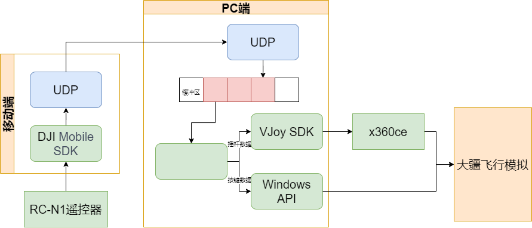
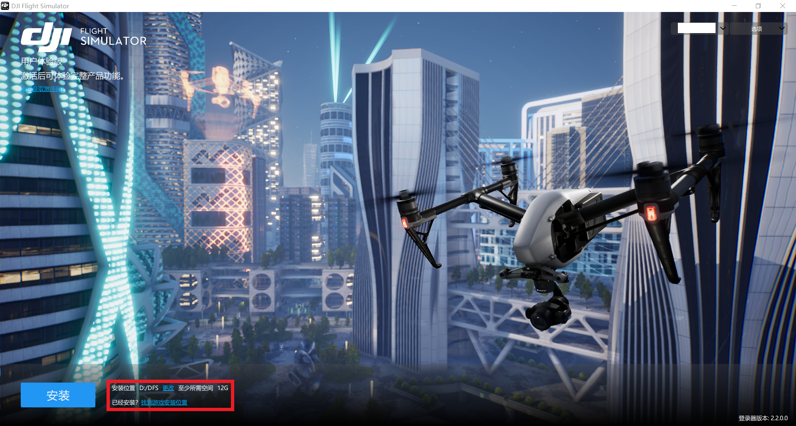
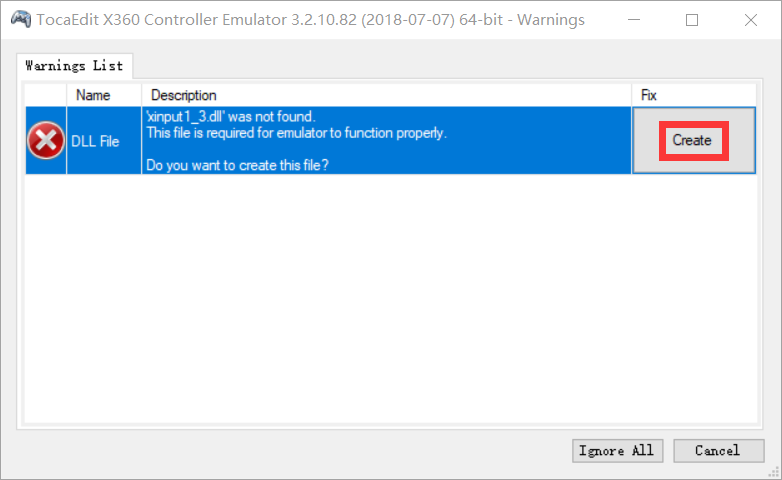
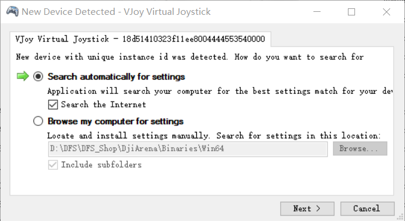
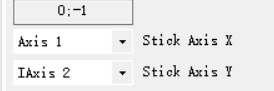
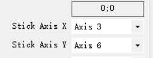
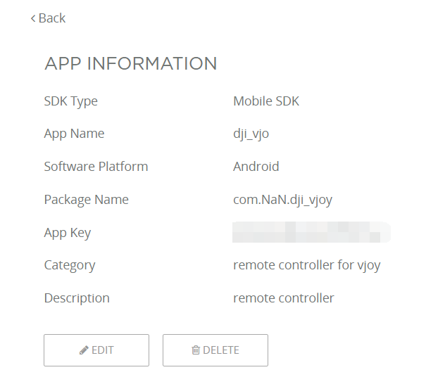
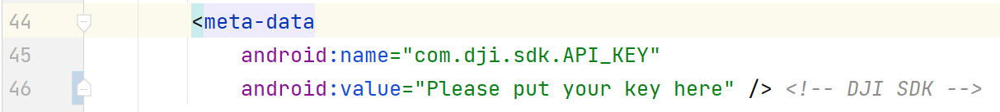
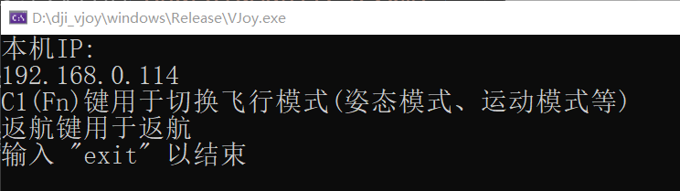
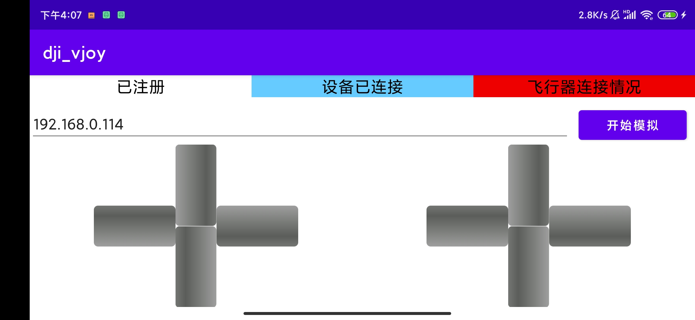

# dji vjoy
## 控制过程

移动端通过大疆SDK收集遥控器摇杆数据(Stick)、按键数据(C1Button、GoHomeButton)以及左侧滚轮数据(leftDial)，通过UDP发送至PC端。

PC端从移动端获取遥控器数据，通过VJoy SDK模拟虚拟手柄，将摇杆数据映射至VJoy Virtual Joystick[0]，再通过x360ce模拟成xbox360手柄输入大疆飞行模拟(DFS)；其余数据根据功能映射至键盘事件，触发DFS事件，即云台旋转、自动返航和切换飞行模式。

## 使用方法
### 安装大疆飞行模拟
注意记录游戏`安装位置`：

### 安装VJoy驱动
运行`driver/VJoySetup_DriverOnly.exe`安装驱动。

### 设置x360ce
将`x360ce/x360ce_x64.exe`复制到`游戏安装位置/DFS_Shop/DjiArena/Binaries/Win64`，运行`x360ce_x64.exe`，根据提示操作：

第二次弹出可忽略。

切换至Controller 1选项卡，使用如下设置：

点击save保存后关闭。

### 注册SDK
进入[DJI Developer](https://developer.dji.com/user/apps/#all)，创建APP，填写正确的应用名称和包名。

将App Key补充至安卓项目的`AndroidManifest.xml`中。

最后构建项目并安装到手机上。

### 编译Windows应用
使用VS编译`windows/VJoy.sln`项目。

### 使用
电脑运行编译后的windows应用`VJoy.exe`

手机连接遥控器后运行`dji_vjoy`，等待上方状态条显示已注册和设备已连接后填写电脑IP，点击开始模拟按钮，注意不要启动飞行器避免意外发生。

最后启动大疆飞行模拟。